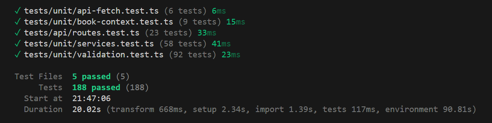
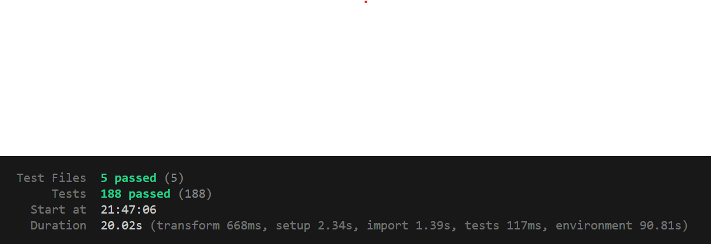

# Story Bible — Unit Test Plan

## 1. Overview

This document describes the unit test plan for the Story Bible web application. Tests are written using **Vitest** and cover four key areas: API route behavior, book context resolution, service layer database interactions, and input validation schemas. All tests run without a live database or network connection — Prisma and NextAuth are fully mocked.

---

## 2. Test Environment

| Item               | Detail                                   |
| ------------------ | ---------------------------------------- |
| Test Framework     | Vitest                                   |
| TypeScript Support | Native (via Vitest)                      |
| Runtime            | Node.js 18+                              |
| Database           | Mocked via `prisma-mock.ts` (no live DB) |
| Auth               | Mocked via `vi.mock('next-auth')`        |
| DOM assertions     | `@testing-library/jest-dom/vitest`       |
| Run command        | `npm test` or `npx vitest run`           |

---

## 3. Test Files & Coverage

### `tests/api/routes.test.ts` — API Route Behavior

Tests Next.js route handlers directly by importing and invoking them with mock `Request` objects. Covers authentication guards, role-based authorization, and correct service delegation.

### `tests/unit/book-context.test.ts` — Book Context Resolution

Tests the `getBookContext()` utility that every API route depends on. Verifies session checking, header vs. fallback book ID resolution, and membership lookups.

### `tests/unit/services.test.ts` — Service Layer

Tests all 10 service modules (character, power, motivation, faction, location, storyArc, plotEvent, timeline, item, search). Verifies correct Prisma query construction — scoping, relations, ordering, and data merging.

### `tests/unit/validation.test.ts` — Validation Schemas

Tests all 12 Zod schemas (login, register, invite, character, power, motivation, faction, location, storyArc, plotEvent, timelineEvent, item). Verifies accept/reject behavior including boundary values, enum enforcement, optional fields, and default values.

### `tests/unit/api-fetch.test.ts` — API Client

Tests the `apiFetch` utility and `setActiveBookId`. Verifies header injection, merging, and reactivity to book ID changes.

---

## 4. Test Cases

### Module: API Routes (`routes.test.ts`)

| ID   | Suite                       | Test Case           | Expected Result                        |
| ---- | --------------------------- | ------------------- | -------------------------------------- |
| R-01 | GET /api/characters         | No book context     | 401 Unauthorized                       |
| R-02 | GET /api/characters         | Authenticated       | 200 + characters array                 |
| R-03 | GET /api/characters         | Authenticated       | Passes correct bookId to service       |
| R-04 | POST /api/characters        | No book context     | 401 Unauthorized                       |
| R-05 | POST /api/characters        | Role = viewer       | 403 Forbidden                          |
| R-06 | POST /api/characters        | Role = owner        | 201 + calls service with bookId        |
| R-07 | POST /api/characters        | Role = collaborator | 201 + calls service with bookId        |
| R-08 | POST /api/characters        | Validation failure  | 400 + field errors                     |
| R-09 | GET /api/characters/[id]    | No book context     | 401 Unauthorized                       |
| R-10 | GET /api/characters/[id]    | Character not found | 404 Not Found                          |
| R-11 | GET /api/characters/[id]    | Character found     | 200 + character object                 |
| R-12 | PUT /api/characters/[id]    | No book context     | 401 Unauthorized                       |
| R-13 | PUT /api/characters/[id]    | Role = viewer       | 403 Forbidden                          |
| R-14 | PUT /api/characters/[id]    | Role = owner        | 200 + calls update                     |
| R-15 | PUT /api/characters/[id]    | Role = collaborator | 200                                    |
| R-16 | DELETE /api/characters/[id] | No book context     | 401 Unauthorized                       |
| R-17 | DELETE /api/characters/[id] | Role = viewer       | 403 Forbidden                          |
| R-18 | DELETE /api/characters/[id] | Role = owner        | 200 + calls delete                     |
| R-19 | GET /api/books              | No session          | 401 Unauthorized                       |
| R-20 | GET /api/books              | Authenticated       | 200 + books + activeBookId             |
| R-21 | POST /api/books             | No session          | 401 Unauthorized                       |
| R-22 | POST /api/books             | Name is empty       | 400 + "Name is required"               |
| R-23 | POST /api/books             | Valid request       | 201 + creates book + sets activeBookId |

---

### Module: Book Context (`book-context.test.ts`)

| ID   | Test Case                                 | Expected Result                          |
| ---- | ----------------------------------------- | ---------------------------------------- |
| B-01 | No session                                | Returns null                             |
| B-02 | Session with no user                      | Returns null                             |
| B-03 | No bookId (no header, no activeBookId)    | Returns null                             |
| B-04 | User not a member of book                 | Returns null                             |
| B-05 | Valid x-book-id header                    | Returns context with correct bookId/role |
| B-06 | No header, falls back to activeBookId     | Returns context from DB lookup           |
| B-07 | Correct role returned from BookMember     | Returns context with viewer role         |
| B-08 | Header takes precedence over activeBookId | Uses header bookId, skips user lookup    |
| B-09 | No request arg, no activeBookId           | Returns null                             |

---

### Module: Service Layer (`services.test.ts`)

Each of the 10 services (character, power, motivation, faction, location, storyArc, plotEvent, timeline, item, search) is tested for:

| ID   | Test Case                           | Expected Result                         |
| ---- | ----------------------------------- | --------------------------------------- |
| S-01 | `getAll` scopes by bookId           | `where: { bookId }` in Prisma call      |
| S-02 | `getAll` includes correct relations | Expected `include` shape present        |
| S-03 | `getAll` orders correctly           | Correct `orderBy` field and direction   |
| S-04 | `create` merges bookId into data    | `data` contains both payload and bookId |
| S-05 | `getById` queries by id             | `where: { id }` in Prisma call          |
| S-06 | `update` passes data and id         | Correct `where` + `data` in Prisma call |
| S-07 | `delete` passes id                  | `where: { id }` in Prisma call          |

**Search service additionally tested for:**

| ID   | Test Case                                     | Expected Result                            |
| ---- | --------------------------------------------- | ------------------------------------------ |
| S-08 | `globalSearch` queries all 9 entity types     | All 9 Prisma models called with bookId     |
| S-09 | `globalSearch` uses case-insensitive contains | `mode: "insensitive"` on name/title fields |
| S-10 | `globalSearch` tags results with entityType   | Each result has `entityType` property      |

---

### Module: Validation Schemas (`validation.test.ts`)

12 schemas tested across ~90 individual test cases. Key patterns per schema:

| Schema                | Tests Include                                                                                                                        |
| --------------------- | ------------------------------------------------------------------------------------------------------------------------------------ |
| `loginSchema`         | Valid input, missing/invalid email, missing/short password                                                                           |
| `registerSchema`      | Valid input, missing name, empty name, name length boundary (100), invalid email, short password                                     |
| `inviteSchema`        | Valid collaborator/viewer, invalid email, missing role, invalid role enum                                                            |
| `characterSchema`     | Valid full/minimal input, empty/too-long name (200 char boundary), invalid/missing type, nullable factionId, omitted optional fields |
| `powerSchema`         | Valid full/minimal, empty/missing name, name boundary (200), omitted optionals                                                       |
| `motivationSchema`    | All 4 category values, empty name, name boundary, invalid/missing category                                                           |
| `factionSchema`       | Valid with/without description, empty/missing name, name boundary                                                                    |
| `locationSchema`      | All 5 type values, required fields, name boundary, invalid type, nullable parentId                                                   |
| `storyArcSchema`      | All types/statuses, default status ("planned"), title boundary (300), invalid enums, nullable parentArcId                            |
| `plotEventSchema`     | Default order (0), missing/empty storyArcId, nullable locationId/timelineEventId                                                     |
| `timelineEventSchema` | Default order (0), title boundary (300), nullable locationId                                                                         |
| `itemSchema`          | All 5 type values, name boundary (200), nullable locationId                                                                          |

---

### Module: API Client (`api-fetch.test.ts`)

| ID   | Test Case                               | Expected Result                     |
| ---- | --------------------------------------- | ----------------------------------- |
| A-01 | Calls fetch with URL and options        | fetch called once with correct args |
| A-02 | Adds x-book-id when activeBookId is set | Header present with correct value   |
| A-03 | No x-book-id when activeBookId is null  | Header absent                       |
| A-04 | Reflects setActiveBookId changes        | Subsequent calls use new book ID    |
| A-05 | Preserves existing headers              | Content-Type header retained        |
| A-06 | Merges x-book-id with custom headers    | All headers present simultaneously  |

---

## 5. Screenshot Requirements

For submission, capture screenshots of:

1. Full terminal output of `npx vitest run` showing all test suites passing
   
2. The Vitest summary table (test suites count, tests count, duration)
   
3. No tests required fixes — all 198 tests passed on the initial run,
   indicating the implementation was correct prior to test execution.

---

## 6. Pass/Fail Criteria

- All test cases must pass for the suite to be considered successful
- A test is **passing** if Vitest reports it with ✓ (green)
- A test is **failing** if Vitest reports it with ✕ and outputs a diff or error
- The overall suite passes when Vitest exits with code 0
  **Outcome:** All 198 tests passed. Vitest exited with code 0.

